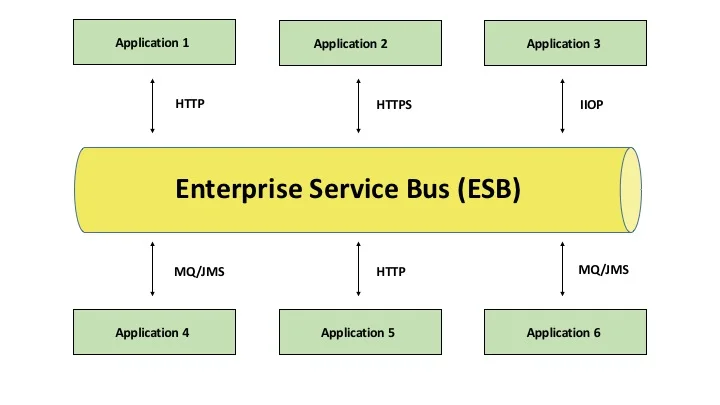
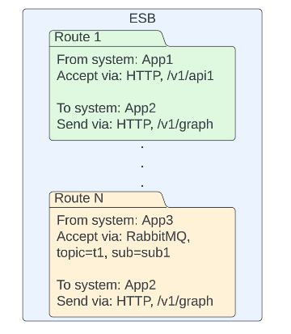
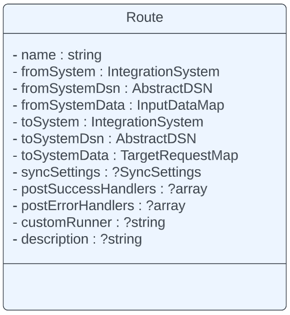
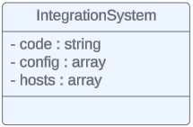

# Library concept

    

 Fig. 1 ESB architecture pattern

The main idea of any ESB - middleware between N systems.
Systems can be connected via any known ways of communication transports such as HTTP, MQ etc.
Also, provide tools for this communication such as sync tables, logs, healthchecks ect.

Our implementation supports all main features and provides a lot of ways for customisation them.

For most cases, you need to do similar things and steps

- Accept data from system 1
- Validate data
- Transform data
- Send data to system 2
- Save communication logs

So, to optimise this steps we built our library on the top of **Route concept** 

## Route concept

    

 Fig. 2 Routes 

Route is core entity ([implementation](../src/Entity/Route.php)), which save all information for particular communication between system A and system B.    
For example, between Application 1 and Application 4 (Fig. 1) ESB accepts data from App. 1 via HTTP, transform them to format acceptable for system App. 4 and
transfer via message queue to it. 

### Route entity

    

For correct work of Route entity, we need to set rules, that will describe
our communication.

Fields description

- name (string) - route's naming. Usually used as PK
- fromSystem (IntegrationSystem) - name of system, which the data is being received.
- fromSystemDsn (AbstractDSN) - settings, describes rules for incoming data (how and from)
- fromSystemData (InputDataMap) - settings, describes incoming data. Contains also validation rules
- toSystem (IntegrationSystem) - name of system, which the data is being sent
- toSystemDsn (AbstractDSN) - settings, describes rules for request\target data (how and where)
- toSystemData (TargetRequestMap) - describes target request format, headers, response and authentication settings
- syncSettings (SyncSettings) - describes how to store sync information. Can be empty
- postSuccessHandlers (array) - set of handlers, runs after success transferring data. Can be empty
- postErrorHandlers (array) - set of handlers, runs ager unsuccessful transferring data. Can be empty
- customRunner (string) - override default core runner. Can be empty
- description - any text describes our Route. Can be empty

### IntegrationSystem

    

Is container for settings of request lifecycle. Could be used withing client([EsbClientInterface](../src/Client/EsbClientInterface.php))
to dynamic resolve host(due to environment) or log response due to settings(for debugging). Could be also useful for
strategy within custom middleware.

### AuthServicePool

Contains services, implementing [AuthServiceInterface](../src/Auth/AuthServiceInterface.php).
Route has dedicated config section to match Auth-service.

### ClientPull

Contains services, implementing [EsbClientInterface](../src/Client/EsbClientInterface.php).
Clients matching is happening by **Route::toSystemDsn**

### QueueProcessing

[QueueFactoryInterface](../src/Queue/QueueFactoryInterface.php), [QueueConsumerInterface](../src/Queue/QueueConsumerInterface.php),
[QueueProducerInterface](../src/Queue/QueueProducerInterface.php), [QueueConfigInterface](../src/Queue/QueueConfigInterface.php)
have to be implemented to use [QueueMessageConsumer](../src/QueueMessageConsumer.php)