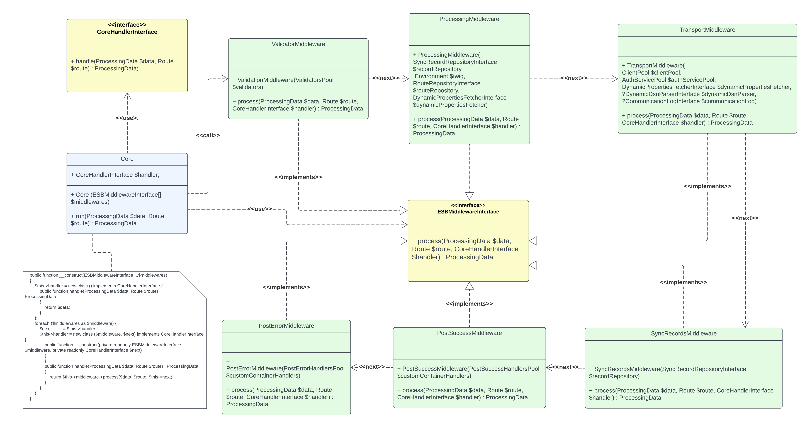
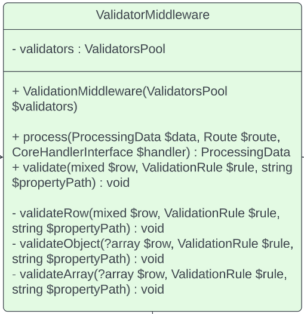

# Architecture

    

 Fig. 1 class diagram

Implementation of ESB pattern was built on the top of _middleware pattern_ (chain of
executable classes). There are 6 core middlewares:

- ValidatorMiddleware
- ProcessingMiddleware
- TransportMiddleware
- SyncRecordsMiddleware
- PostSuccessMiddleware
- PostErrorMiddleware

All of them handled with Core class. 

## ValidatorMiddleware

    

Main function - validate incoming data and go to next middleware. If validation can't
be passed - throw error `ValidationException`