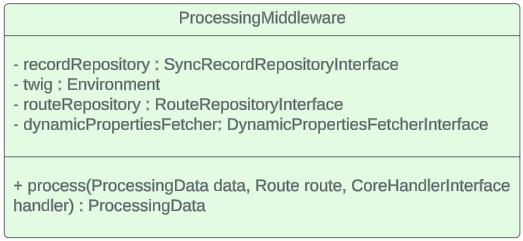
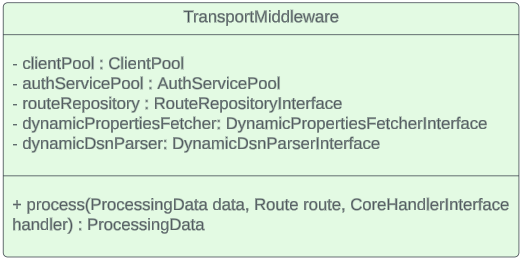
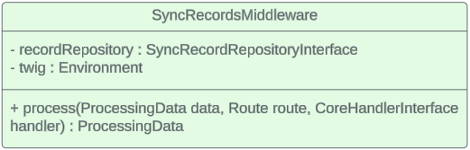
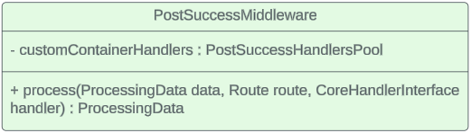
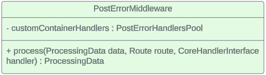

# Architecture

    

 Fig. 1 class diagram

Implementation of ESB pattern was built on the top of _middleware pattern_ (chain of
executable classes). There are 6 core middlewares:

- ValidatorMiddleware
- ProcessingMiddleware
- TransportMiddleware
- SyncRecordsMiddleware
- PostSuccessMiddleware
- PostErrorMiddleware

All of them handled with Core class. Core could be supplemented with any additional Middlewares [ContainerConfig.php:67](../src/ContainerConfig.php)

## [ValidatorMiddleware](../src/Middleware/Core/ValidatorMiddleware.php)

    

Main function - validate incoming data and go to next middleware. If validation can't
be passed - throw error `ValidationException`

## [ProcessingMiddleware](../src/Middleware/Core/ProcessingMiddleware.php)

    

The goal of ProcessingMiddleware is to render content(by TWIG), which was set in 'template' section of config, prevent duplicate
request(if option was set through route config), 
update [ProcessingData](../src/DTO/ProcessingData.php) with [TargetRequest](../src/DTO/TargetRequest.php).
If duplicate call detected, will throw `DuplicateRecordException`

## [TransportMiddleware](../src/Middleware/Core/TransportMiddleware.php)

    

Will add authorization data to [TargetRequest](../src/DTO/TargetRequest.php) via `AuthServicePool` if auth config was set.
Main goal - to send content, of  `TargetRequest` to dedicated system via `ClientPool`. As result, will supplement
[ProcessingData](../src/DTO/ProcessingData.php) with [TargetResponse](../src/DTO/TargetResponse.php),
which contain response of outer system.

## [SyncRecordsMiddleware](../src/Middleware/Core/SyncRecordsMiddleware.php)

    

If syncSettings config is set, will store processed data to control further duplicate request

## [PostSuccessMiddleware](../src/Middleware/Core/PostSuccessMiddleware.php)

    

Will be called only if `TransportMiddleware` was successive. Will run chain of handlers, dedicated to Route.
Goal of SuccessHandlers is further processing of message after success call(outer requests, fire events, store something, etc)

## [PostErrorMiddleware](../src/Middleware/Core/PostErrorMiddleware.php)

    

Will process message through PostErrorHandlersPool, dedicated to Route. Will throw `NonSuccessException` in a result